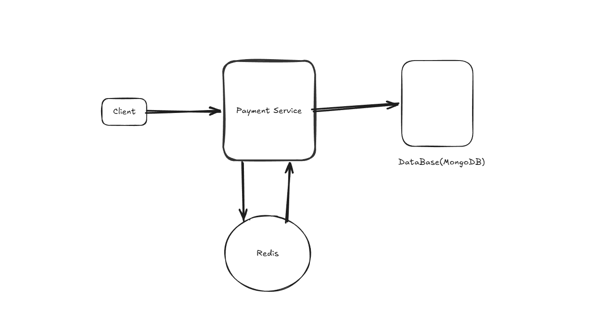
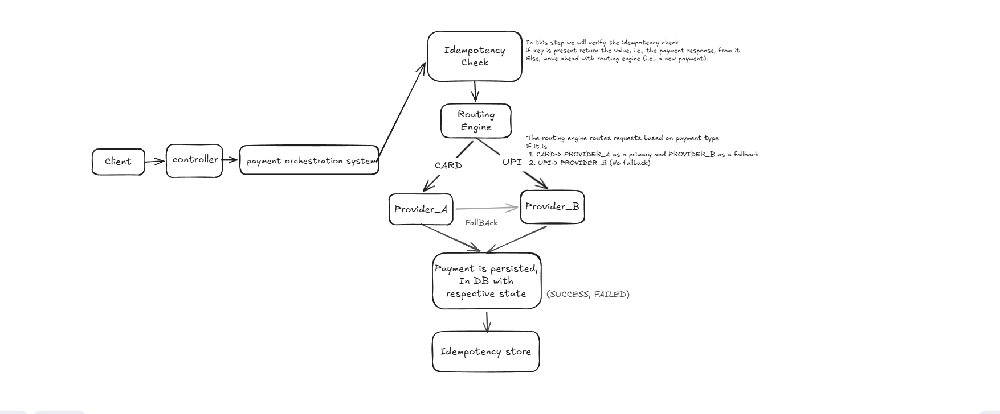

# 💳 Mini Payment Orchestration System

---

## 🚀 Overview

This project implements a simplified **Payment Orchestration System**, inspired by real-world payment platforms.

The system acts as an intermediary layer between clients and multiple payment providers, enabling:

* Smart routing of transactions
* Failover and retry mechanisms
* Idempotent request handling
* Reliable payment status tracking

The goal is to simulate how modern payment systems ensure **high availability, consistency, and fault tolerance**.

---

## 📌 Functional Requirements

* User Should be able to make Payment 
* User Should be able to Fetch Payment details
* Route payments based on method:

    * CARD → Provider A (primary), Provider B (fallback)
    * UPI → Provider B
* Retry failed transactions
* Failover to alternate provider
* Idempotency support

---

## ⚙️ Non-Functional Requirements

* High availability using retry + failover
* Low latency using Redis caching
* Scalability with stateless service design
* Reliability with idempotent operations
* Maintainability with clean architecture
* Observability through logging

---

## 🧠 High-Level Design Overview

Architecture Layers:

### Key Design Patterns Used

* Strategy Pattern → Provider abstraction
* Factory Pattern → Provider selection
* Layered Architecture → Separation of concerns

---

## 📡 API Endpoints

### 🔹 Create Payment

POST /api/v1/payments

Headers:
Idempotency-Key: <unique-key>

Request Body:
{
"amount": 100,
"currency": "INR",
"method": "CARD"
}

Response:
{
"paymentId": "123",
"status": "SUCCESS",
"provider": "PROVIDER_A"
}

**NOTE:** success Rate of this API is determined as: 
For Payment Type=CARD= 70% and UPI=90% (check implementation for more details)
---

### 🔹 Fetch Payment

GET /api/v1/payments/{id}

Response:
{
"id": "123",
"status": "SUCCESS",
"provider": "PROVIDER_A"
}

---

## 🔁 Flow Explanation

1. Client sends payment request with Idempotency-Key
2. System checks Redis for duplicate request
3. Routing engine determines provider sequence
4. Payment is sent to primary provider
5. If failure occurs:

    * Retry logic is triggered
    * If still failing → failover to secondary provider
6. Final result is stored in mongoDB
7. Response is cached in Redis for idempotency
8. Response returned to client

---

## ⚡ Performance Considerations

* Redis used for fast idempotency checks (O(1) lookup)
* Retry mechanism reduces transient failure impact
* Failover improves success rate
* Database indexing can optimize query performance
* Stateless service enables horizontal scaling

---

## 🧠 AI Prompts Used

* Designed a payment orchestration system with retry, failover, and idempotency
* Implemented Redis-based idempotency configuration handling in Spring Boot
* explain to me why idempotence key idempotency key is passed from client and best way to pass it to server.
* Generate and give me Entity Payment class, which should include fields ObjectID, amount, type, status, provider, idempotenceKey, currency and also mongo repository configuration with lombok annotations(used similar kind od prompt from other entities and DTO creation)
* sharing you my architecture flow and functionality and repository details generate positive and negative edge test cases along with the test case documentation
* A complete and production-ready docker-compose.yml file for MongoDB and Redis
  Necessary configuration properties for integrating both MongoDB and Redis in a Spring Boot application 

AI Tools Used- CodeX plugin, Claude, Chatgpt.

---

## 🔧 Tech Stack Used

* Java 17
* Spring Boot 3
* Spring Data JPA
* MongoBD
* Redis
* Docker & Docker Compose
* JUnit & Mockito
* Lombok

---

## ▶️ How to Run the Project

### 1. Clone Repository

git clone <your-repo-url>

### 2. Start Dependencies (MongoDB + Redis)

docker-compose up -d

### 3. Run Application

./mvnw spring-boot:run

### 4. Test APIs

Use Postman or curl:

curl -X POST http://localhost:8080/api/v1/payments

---

## 🚀 Improvements for Future Scope

* Circuit Breaker (Resilience4j) for fault tolerance
* Asynchronous processing using Kafka
* Distributed tracing (Zipkin / OpenTelemetry)
* Metrics monitoring (Prometheus + Grafana)
* Real payment provider integrations
* Rate limiting and security enhancements
* API gateway integration

---
## 📄 Test Documentation

Detailed test scenarios are available in:
src/main/resources/docs/test-doc.md
## 📊 Conclusion

This system demonstrates how real-world payment orchestration platforms handle:

* Fault tolerance
* Scalability
* Reliability

It is designed with production-level best practices and extensibility in mind.
